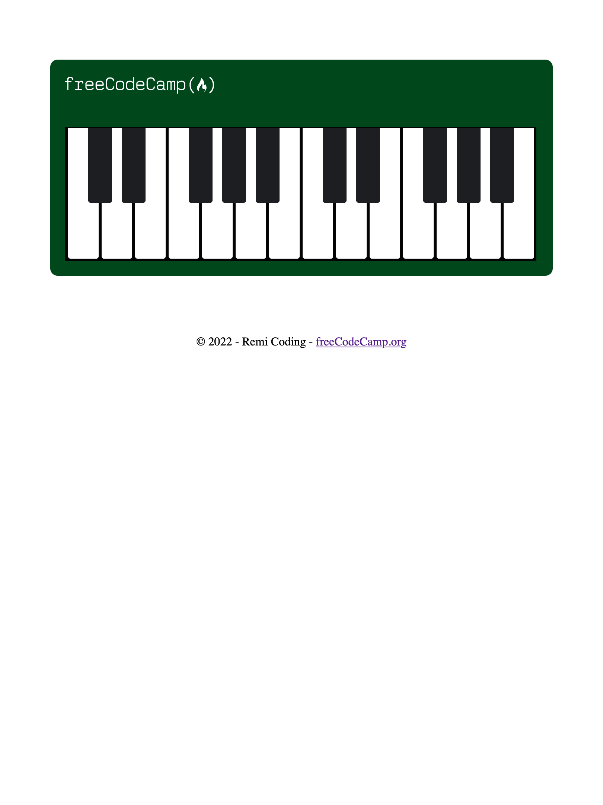
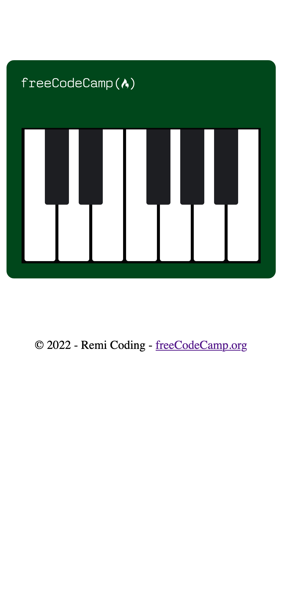

# Piano

This repository contains the HTML and CSS for the **Learn Responsive Web Design by Building a Piano** course by [freeCodeCamp](https://www.freecodecamp.org/learn/2022/responsive-web-design/).

Responsive Design tells the webpage how it should look on different-sized screens.

The `index.html` file contains HTML tags and appropriate classes to use to structure and manipulate the elements on the page.

The `css/styles.css` file is used with an emphasis on Responsive Design. The project allows one to learn more about media queries and pseudo selectors to code a piano.

The page can be viewed here: [Piano](https://remicoding.github.io/piano-page/)

For your convenience, here are screenshots of the page:

